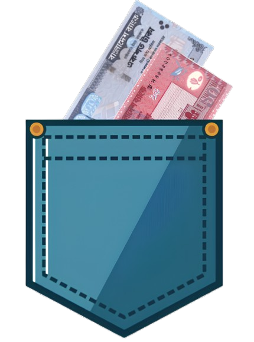
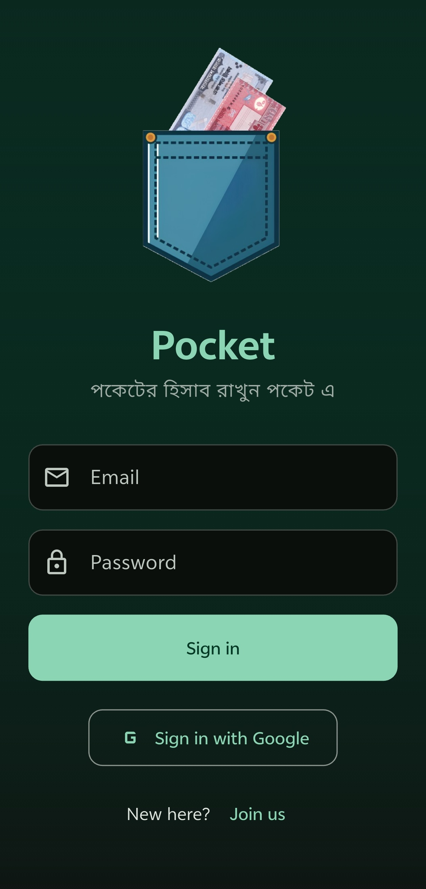
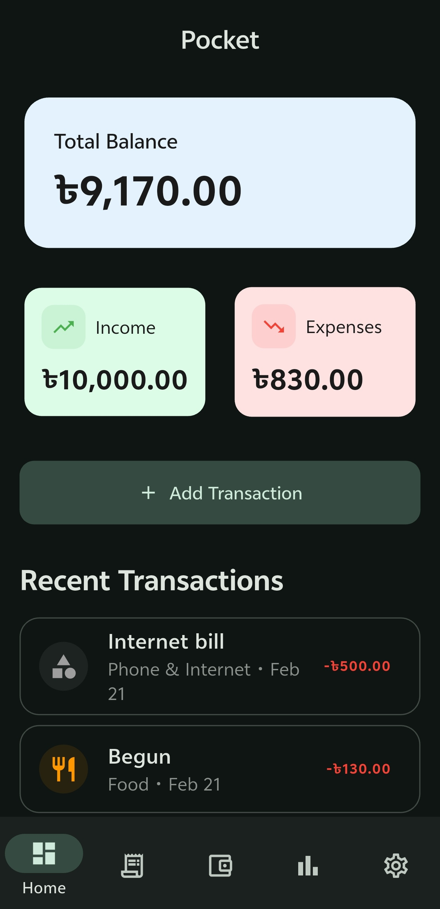
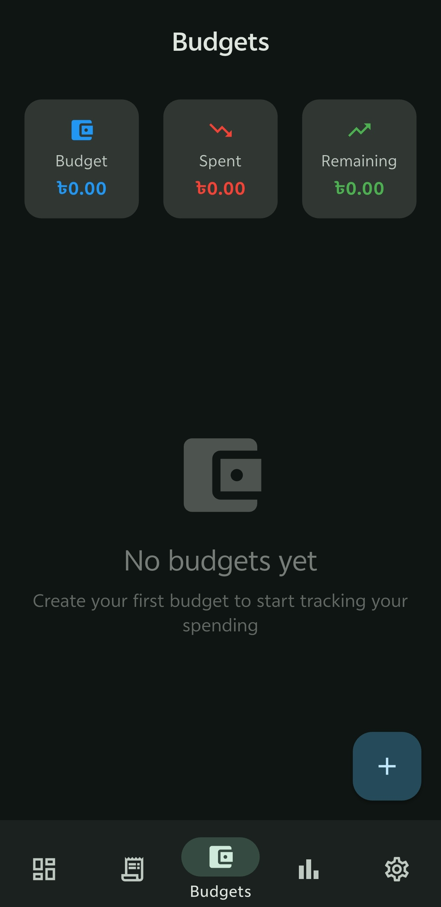
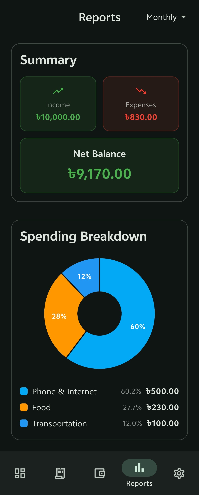
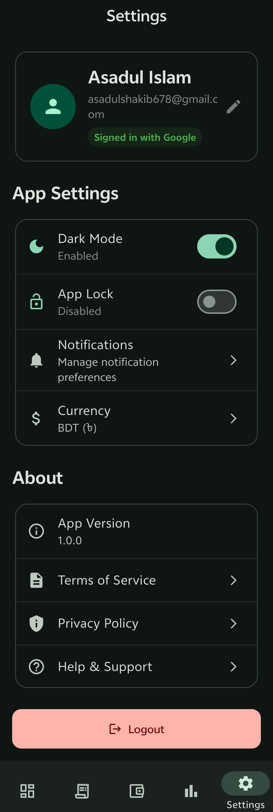

<p align="center">
  
</p>

<h1 align="center">Pocket</h1>

<p align="center">
  <strong>Your personal finance companion — beautifully simple, powerfully smart.</strong>
</p>

<p align="center">
  
  
  
  
  
</p>

<p align="center">
  <a href="https://play.google.com/store/apps/details?id=com.asad.pocket_app" target="_blank">
    
  </a>
</p>

---

## ✨ Overview

**Pocket** is a modern, intelligent personal finance manager built with Flutter and Firebase. While standard finance apps only record personal expenses, Pocket takes financial tracking a step further by featuring a **comprehensive Peer-to-Peer (P2P) Debt & Loan ecosystem**, alongside smart budgeting, detailed analytics, and an offline-first architecture powered by Material Design 3.

---

## 🌟 Spotlight: Peer-to-Peer (P2P) Debt & Loan Tracker

> **The standout feature that sets Pocket apart from traditional expense managers.**

Most budget apps stop at recording what *you* spend. Pocket solves the common headache of shared finances, splitting bills, and tracking money lent to or borrowed from friends, roommates, and colleagues:

* 🤝 **Dual-Ledger Tracking (Lent vs. Borrowed)**: Keep crystal-clear records of who owes you and whom you owe with automatic balance calculations.
* 💳 **Partial Payments & History**: Log gradual repayments with timestamps and notes, watching remaining debt decrease in real time.
* 🔄 **Smart Settlement Workflow**: Send and receive formal settlement requests with mutual approval to avoid disputes.
* 📩 **One-Tap Peer Invitations & Reminders**: Generate instant invite links or email summaries with direct Play Store download links so peers can collaborate on tracking.
* ⚡ **Offline-First & Real-Time Sync**: Add or update debts anywhere without internet; Pocket caches changes locally and syncs them automatically via Firestore once you're back online.

---

## 📱 Screens

<p align="center">
  &nbsp;&nbsp;
  &nbsp;&nbsp;
  
</p>

<p align="center">
  &nbsp;&nbsp;
  &nbsp;&nbsp;
  
</p>

<p align="center">
  
</p>

---

## 📸 Features

| Feature | Description |
|---------|-------------|
| 📊 **Dashboard** | At-a-glance view of total balance, income & expenses |
| 💳 **Transactions** | Add, edit, delete income & expense entries with categories |
| 🎯 **Budgets** | Set spending limits per category and track progress |
| 🤝 **P2P Debts & Loans** | Track money lent and borrowed with peer confirmations, partial payments & settlement requests |
| 📈 **Reports** | Visual pie charts and spending breakdowns |
| 🔐 **Authentication** | Email/password & Google Sign-In |
| ☁️ **Cloud Sync** | Real-time Firestore sync — offline-first architecture |
| 🌓 **Theme** | Toggle between light & dark mode |
| 🧾 **Receipts** | Upload receipt images to Firebase Storage |

---

## 🏗️ Architecture

```
lib/
├── main.dart                    # App entry point & theme configuration
├── constants/                   # App-wide constants
├── models/
│   ├── transaction.dart         # Transaction data model
│   ├── budget.dart              # Budget data model
│   └── debt.dart                # Debt & loan tracking model with payments & statuses
├── providers/
│   ├── auth_provider.dart       # Firebase Auth + Google Sign-In
│   ├── transaction_provider.dart # CRUD + real-time Firestore sync
│   ├── budget_provider.dart     # Budget management + Firestore
│   ├── debt_provider.dart       # P2P debt/loan sync, settlements & invitations
│   └── theme_provider.dart      # Dark/light mode persistence
├── screens/
│   ├── dashboard_screen.dart    # Home — balance, income, expenses
│   ├── transactions_screen.dart # Full transaction history + filters
│   ├── add_transaction_screen.dart # Add/edit transaction form
│   ├── budgets_screen.dart      # Budget cards + progress bars
│   ├── debts_screen.dart        # P2P debts & loans manager (Lent / Borrowed)
│   ├── reports_screen.dart      # Charts & spending analysis
│   ├── settings_screen.dart     # Profile, preferences, about
│   ├── login_screen.dart        # Email & Google login
│   ├── signup_screen.dart       # Email registration
│   └── main_navigation.dart     # Bottom navigation shell
└── utils/
    └── category_helpers.dart    # Shared category icons & colors
```

### Design Patterns
- **Provider** for state management
- **Offline-first** with Firestore persistence enabled
- **Real-time listeners** + one-time fetch fallback for reliability
- **Material Design 3** theming with seed-based color scheme

---

## 🛠️ Tech Stack

| Layer | Technology |
|-------|-----------|
| **Framework** | Flutter 3.8 / Dart 3.8 |
| **UI** | Material Design 3 |
| **State Management** | Provider |
| **Backend** | Firebase (Auth, Firestore, Storage) |
| **Auth** | Email/Password + Google Sign-In |
| **Database** | Cloud Firestore (offline-first) |
| **Charts** | fl_chart |
| **Localization** | intl |

---

## 🚀 Getting Started

### Prerequisites

- Flutter SDK `^3.8.1`
- A Firebase project with **Authentication**, **Cloud Firestore**, and **Storage** enabled
- Android Studio / VS Code with Flutter plugin

### Installation

1. **Clone the repository**
   ```bash
   git clone https://github.com/your-username/pocket-app.git
   cd pocket-app
   ```

2. **Install dependencies**
   ```bash
   flutter pub get
   ```

3. **Configure Firebase**
   - Create a Firebase project at [console.firebase.google.com](https://console.firebase.google.com)
   - Enable **Email/Password** and **Google** sign-in methods
   - Enable **Cloud Firestore** and **Storage**
   - Download your `google-services.json` (Android) and/or `GoogleService-Info.plist` (iOS)
   - Place them in the appropriate platform directories

4. **Run the app**
   ```bash
   flutter run
   ```

---

## 🔥 Firebase Structure

```
users/
└── {userId}/
    ├── transactions/
    │   └── {transactionId}/
    │       ├── id: string
    │       ├── title: string
    │       ├── amount: number
    │       ├── type: "income" | "expense"
    │       ├── category: string
    │       ├── account: string
    │       ├── date: ISO 8601 string
    │       ├── notes: string?
    │       └── receiptUrl: string?
    ├── budgets/
    │   └── {budgetId}/
    │       ├── id: string
    │       ├── category: string
    │       ├── limit: number
    │       ├── spent: number
    │       └── icon: string (emoji)
    └── debts/
        └── {debtId}/
            ├── id: string
            ├── peerName: string
            ├── peerEmail: string?
            ├── amount: number
            ├── amountPaid: number
            ├── type: "lent" | "borrowed"
            ├── status: "active" | "settled" | "pending_approval" | "manual"
            ├── dueDate: ISO 8601 string?
            └── paymentHistory: list<DebtPayment>
```

---

## 📂 Categories

| Category | Icon | Color |
|----------|------|-------|
| 🍔 Food | `restaurant` | Orange |
| 🚗 Transportation | `directions_car` | Blue |
| 🎬 Entertainment | `movie` | Purple |
| 🛍️ Shopping | `shopping_bag` | Pink |
| 💡 Utilities | `lightbulb` | Green |
| 💼 Salary | `work` | Green |
| 💻 Freelance | `computer` | Teal |

---

## 🤝 Contributing

Contributions are welcome! Please follow these steps:

1. Fork the repository
2. Create a feature branch (`git checkout -b feature/amazing-feature`)
3. Commit your changes (`git commit -m 'Add amazing feature'`)
4. Push to the branch (`git push origin feature/amazing-feature`)
5. Open a Pull Request

---

## 📄 License

This project is licensed under the MIT License — see the [LICENSE](LICENSE) file for details.

---

<p align="center">
  
</p>
